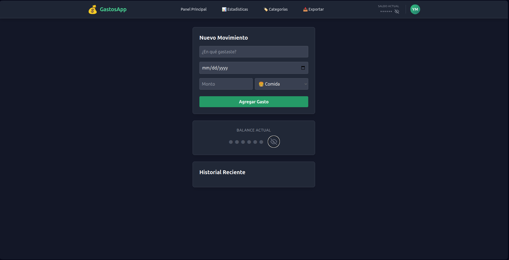

# 💰 GastosApp (Expense Tracker)

Una aplicación web **Fullstack** moderna para la gestión de finanzas personales. Diseñada para registrar gastos, visualizar balances en tiempo real y proteger la privacidad del usuario con un modo "oculto".



## 🚀 Tecnologías

Este proyecto utiliza el stack moderno de React:

* **Frontend:** [React](https://react.dev/) + [Vite](https://vitejs.dev/)
* **Routing:** [React Router DOM](https://reactrouter.com/) (Navegación SPA sin recargas)
* **Estilos:** [Tailwind CSS](https://tailwindcss.com/) (Diseño responsivo y Glassmorphism)
* **Backend (BaaS):** [Supabase](https://supabase.com/) (PostgreSQL en tiempo real)
* **Iconos:** SVG Nativos

## ✨ Características Principales

* **🔒 Modo Privacidad:** Botón de "ojo" para ocultar/desenfocar los montos sensibles en pantalla (ideal para uso en público).
* **📅 Registro Histórico:** Control de gastos con selección de fechas personalizada.
* **🧭 Navegación Fluida:** Sistema de enrutado para moverse entre el Dashboard, Estadísticas y Categorías.
* **⚡ Real-time CRUD:**
    * Crear nuevos movimientos.
    * Leer historial ordenado cronológicamente.
    * Eliminar registros al instante.
* **🎨 UI Moderna:** Interfaz oscura (Dark Mode) con componentes translúcidos y feedback visual.

## 🛠️ Instalación Local

1.  **Clonar el repositorio:**
    ```bash
    git clone [https://github.com/Annorakx/Gastos-App](https://github.com/Annorakx/Gastos-App)
    cd gastos-app
    ```

2.  **Instalar dependencias:**
    ```bash
    npm install
    ```

3.  **Configurar Variables de Entorno:**
    Crea un archivo `.env.local` en la raíz y agrega tus credenciales de Supabase:
    ```env
    VITE_SUPABASE_URL=TU_URL_DE_SUPABASE
    VITE_SUPABASE_KEY=TU_ANON_PUBLIC_KEY
    ```

4.  **Ejecutar:**
    ```bash
    npm run dev
    ```

## 🗺️ Roadmap (Hoja de Ruta)

El desarrollo del proyecto es continuo. Aquí el estado actual y planes futuros:

- [x] **Fase 1: MVP (Producto Mínimo Viable)**
    - [x] Configuración de React + Vite + Tailwind.
    - [x] Conexión a Base de Datos (Supabase).
    - [x] CRUD básico (Crear y Borrar).

- [x] **Fase 2: UX y Navegación (Estado Actual)**
    - [x] Implementación de Navbar Responsive.
    - [x] Routing (Páginas separadas).
    - [x] Soporte para Fechas.
    - [x] **Privacy Mode** (Ocultar saldos).

- [ ] **Fase 3: Visualización de Datos (Próximamente)**
    - [ ] Página de Estadísticas con Gráficos (Chart.js / Recharts).
    - [ ] Filtros por mes y año.

- [ ] **Fase 4: Gestión Avanzada**
    - [ ] CRUD de Categorías (Crear categorías personalizadas).
    - [ ] Edición de gastos existentes.
    - [ ] Autenticación de Usuarios (Login/Register).

---
Desarrollado con ❤️ por Yussef Merhi